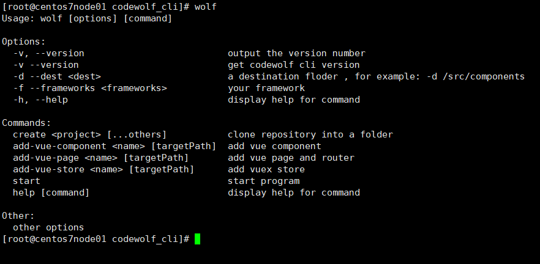
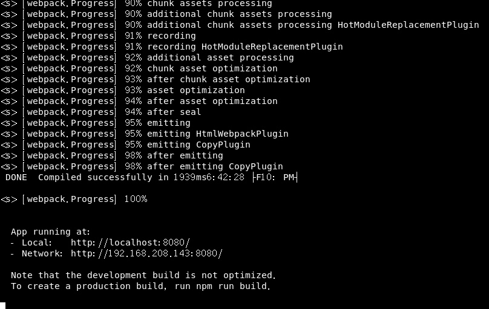
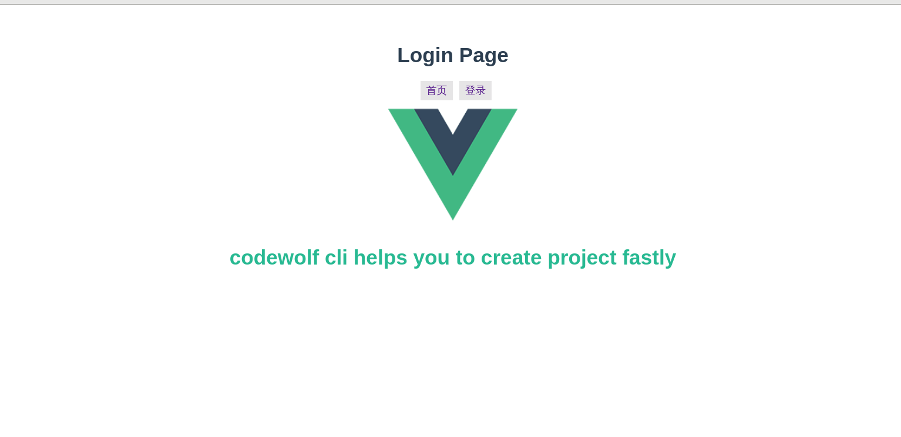
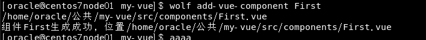
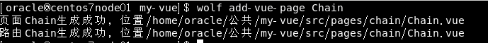
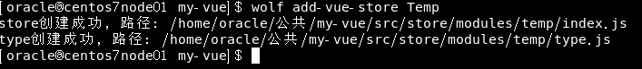

# coldwolf-cli 自定义前端脚手架工具

## 1. 版本功能说明说明

### 1.1 版本: 1.0.0

### 1.2 主要功能:

1. vue2工程项目自动创建, 工程删除了不必要的文件, 添加了less, vueRouter, vuex支持
2. 脚手架支持自动化router, store配置, 无需手动配置
3. 支持创建组件, store, pages, router指令

## 2. 脚手架安装

### 2.1 环境准备

1. Nodejs版本 > 10.0
2. 全局安装Typescript和ts-node

### 2.2 安装操作

1. 从github上下载源码
2. 进入项目根目录
3. 执行 `npm link`
4. 测试, 输入 `wolf`, 出现下图, 则安装成功

## 3. 功能使用说明

### 3.1 创建Vue项目

1. 执行 `wolf create [项目名称]`
2. 执行完成后会自动执行 `npm install`, 并打开浏览器, 无需进一步操作
3. 执行结果如图:

> 自动打开浏览器:

### 3.2 创建Vue组件/页面

1. 创建组件: `wolf add-vue-component <name>  [targetPath]` (name为组件名称, targetPath为组件路径, 为可选值, 默认为src/components)
2. 创建页面: `wolf add-vue-page <name> [targetPath]` (name为页面名称, targetPath为页面路径, 为可选值, 默认为src/pages)

### 3.3 创建vuex的module

1. 命令: `wolf add-vue-store <name> [targetPath]` (name是模块名称, targetPath为目标路径,为可选值, 默认: `src/store/modules`)

## 4. 后续版本更新计划

1. 发布到npm
2. 添加对React typescript Hooks版本的支持
3. 添加对Express Koa的支持
